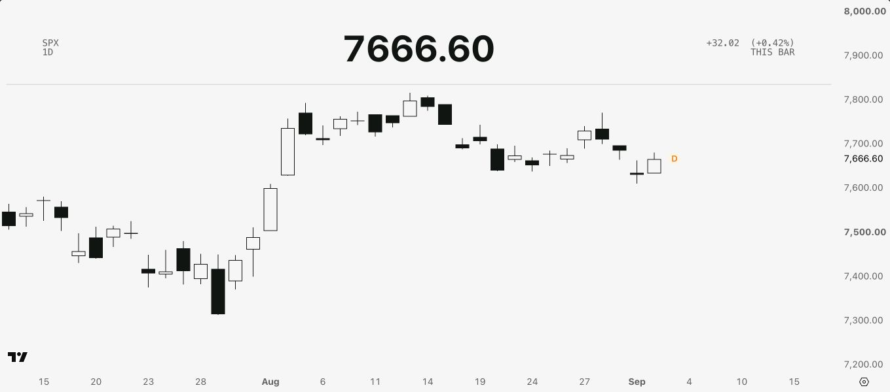
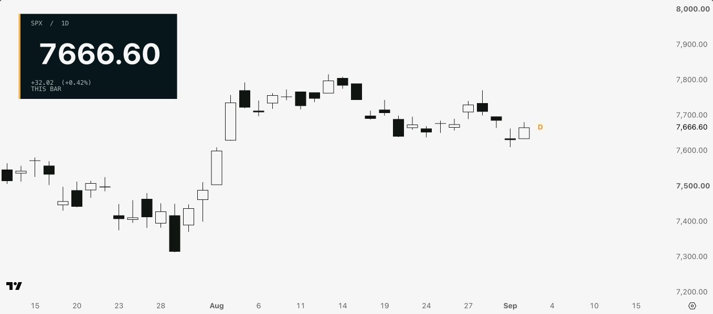
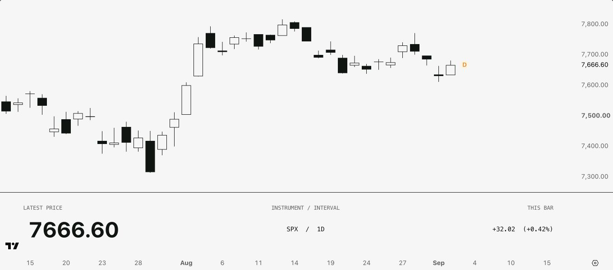

# Automotive Display Studio and composition studies

A set of standalone Pine Script v6 displays using a large readout, monospaced labels, and a restrained color palette. These are independent of TheStrat Suite and require no other scripts. This is an original visual homage, not an official Rivian product.

Start with `display_studio.pine`. It turns the earlier experiments into one configurable
main-chart indicator: choose the information independently from its composition, then choose
the theme, accent, canvas treatment, and candles. The older sources remain as the research
record and as smaller examples.

| Source | Purpose | Placement |
| --- | --- | --- |
| `display_studio.pine` | Consolidated publication candidate: 4 readouts × 4 layouts, 4 themes, optional themed canvas and candles | Main-chart overlay |
| `price_display.pine` | Original latest-price baseline | Top-left overlay |
| `instrument_display.pine` | Content experiments: Range Position, Relative Range, Instrument | Top-left overlay |
| `composition_overlays.pine` | Same price payload in Horizon Header or Inset Panel | Main-chart overlay |
| `console_strip.pine` | Same price payload in a horizontal footer | Separate lower pane |

None has signals, alerts, orders, or external data requests. Display Studio can draw a themed
candle layer and canvas on the main chart; both controls are visible inputs and can be turned
off. The four earlier sources do not recolor the main chart. Console Strip uses `bgcolor` only
for its own pane in the default placement. No script is a TheStrat Suite feature.

The four earlier studies have the scoped desktop verification recorded below. Display Studio
was assembled and statically reviewed on 2026-09-10, but has not yet had its required
TradingView compile/save/reload and visual matrix pass. It is a publication candidate, not a
verified public release. Compact settings are manual adjustments, not automatic responsive
behavior. Other markets, new-bar boundaries, and mobile layouts remain unverified.

The [design notes](DESIGN_NOTES.md) distinguish content choices from composition, and record the trials, retained and rejected ideas, limits, and test status. Ink & Paper was the preferred chart direction. The price baseline still defaults to Cloud & Field; the content study defaults to Ink & Paper. The new compositions use the Ink & Paper chart recipe.

## Install

1. Open a chart in TradingView and create a new indicator in Pine Editor.
2. For the consolidated version, replace the editor contents with `display_studio.pine`.
   Use another source from the table only when reproducing an individual research study.
3. Save the script, then select **Add to chart**.
4. Open the indicator's settings to choose its appearance. Apply the native chart settings below separately; the scripts do not install a chart template.
5. Save the chart layout, reload it, and verify the displayed version and settings.

Compare one display at a time. Several overlays share chart space and can cover one another. Add Console Strip as a new script instance and keep it in its separate lower pane. Native pane placement does not change merely because an existing script's `overlay` declaration is edited.

Saving source and saving a chart layout are separate actions. When updating, open the current saved source from the script library, update or add the correct chart instance, save both source and layout, then reload and verify. An instance can retain an older saved version; its historical read-only editor view is not itself a defect.

## Display Studio

Display Studio is a composition system rather than a list of six mutually exclusive demos.
The **Readout** and **Layout** inputs are independent, so every readout works in every layout:

| Readout | Headline | Supporting context |
| --- | --- | --- |
| Price | Latest chart close | This bar's open-to-close absolute and percentage change |
| Range Position | Close's 0–100% position inside this bar | Current bar definition and edge-case tooltip |
| Relative Range | Current high-low range divided by the prior completed-bar average | Configurable 2–500 bar lookback, 20 by default |
| Instrument | Ticker | Latest price, currency when available, and this-bar percentage |

| Layout | Composition | Placement |
| --- | --- | --- |
| Classic Card | The preferred large-number baseline with a compact label stack and short accent rule | Top left |
| Horizon Header | Instrument left, headline centered, context right, and a thin full-width rule | Top center |
| Inset Panel | Reversed compact panel with a narrow accent edge | Top left |
| Bottom Rail | Wide three-part readout across the bottom of the main chart | Bottom center overlay |

This produces sixteen available readout/layout combinations in one indicator. Price + Classic
Card is the default because it preserves the user's preferred earlier direction. Bottom Rail is the single-script version
of the footer idea; it can cover candles unless enough native bottom margin is reserved. Use
`console_strip.pine` when the footer must occupy a genuinely separate pane.

### Display Studio inputs

| Input | Default | Options / behavior |
| --- | --- | --- |
| Readout | Price | Price, Range Position, Relative Range, Instrument |
| Relative range lookback | 20 | 2–500 prior completed chart bars; used only by Relative Range |
| Short instrument description | On | Instrument only; omitted above 28 characters |
| Layout | Classic Card | Classic Card, Horizon Header, Inset Panel, Bottom Rail |
| Headline size | 56pt | 36, 48, 56, or 64pt |
| Top inset | 3% | 0–15%; ignored by Bottom Rail |
| Theme | Ink | Ink, Field, Charge, Night |
| Accent | Theme | Theme default, blue, gold, or bright green |
| Transparent classic card | Off | Classic Card only |
| Apply theme canvas | On | Independent of themed candles; native canvas still controls unloaded margins and surrounding UI |
| Draw themed candles | On | Draws an OHLC candle layer above the native series; turn off to retain native chart styling |

The default **Ink** treatment recreates the preferred ordinary-candle look: canvas-colored up
bodies with charcoal borders and wicks, and solid charcoal down bodies. The other three themes
make the green and accent explorations operational rather than merely showing color chips:

| Theme | Canvas | Up body | Up edge | Down | Theme accent |
| --- | --- | --- | --- | --- | --- |
| Ink | `#F6F6F6` | `#F6F6F6` | `#101512` | `#101512` | `#FFAC03` |
| Field | `#F6F6F6` | `#5F6559` | `#5F6559` | `#DE311E` | `#5F6559` |
| Charge | `#F2F2F2` | `#72DC57` | `#5F6559` | `#293846` | `#72DC57` |
| Night | `#02171C` | `#84ACB3` | `#84ACB3` | `#FFAC03` | `#FFAC03` |

The candle layer uses the chart's own OHLC and classifies `close >= open` as up. It sits in
front of the native candle series. Turn it off when another chart type or another indicator
should own the candle rendering. The canvas control is independent and can remain on behind
native candles; turn it off when native chart settings should own the background as well.

For a public release, use the ready-to-paste description and release gate in
[`PUBLISHING.md`](PUBLISHING.md). Do not publish until the current consolidated source has
compiled, been added as a fresh chart instance, and passed the recorded matrix.

## Composition gallery

These three designs hold **SPX 1D** and the price payload constant: instrument metadata, latest price, and absolute/percentage change from the current bar's open. They explore arrangement, not new metrics. The original price and content studies remain available.

All three were saved, reloaded, and captured at a 1464 × 681 desktop viewport. Their 1359 × 600 chart-only images show matching visible candles and price values, complete text, and no candle overlap. Console changes the candles' vertical placement because it occupies a real pane. The [test record](DESIGN_NOTES.md#test-record) separates this desktop verification from the limited compact-width tests.

### Horizon Header

Instrument left, large price centered, change right. A thin divider gives the chart a clear header. The side labels were increased from 11pt to 14pt after the first wide-layout inspection.

### Inset Panel

A deep-teal card with a pale price, 12pt supporting text, and a narrow gold edge. Its content column sizes to its text; the surrounding gutters retain percentage sizing. This prevents the initial fixed-column clipping in the tested frames, but does not automatically avoid candles or adapt typography to the viewport.

### Console Strip

Large price left, instrument metadata centered, change right, in a real lower pane. The footer cannot cover candles while kept there, but it reduces the vertical space available to the price chart.

## Composition setup

Use the Ink & Paper candle colors, solid background, grid settings, and 14px native scale text documented below. Override the baseline margins as follows:

| Setting | Horizon Header | Inset Panel | Console Strip |
| --- | --- | --- | --- |
| Source | `composition_overlays.pine` | `composition_overlays.pine` | `console_strip.pine` |
| Composition input | Horizon Header | Inset Panel | Not applicable |
| Headline | 56pt bold default | 56pt bold default | 48pt bold default |
| Supporting monospace | 14pt | 12pt | 12pt captions, 14pt values |
| Native main-chart top / bottom margins | 25% / 15% | 25% / 15% | 10% / 10% |
| Native right margin | 10 bars | 10 bars | 10 bars |
| Script top inset | 3% | 3% | Not applicable |
| Separate-pane height | Not applicable | Not applicable | About 141px in the 1464 × 681 comparison viewport |

The overlay script defaults to Horizon Header, 56pt, and a 3% top inset. Its headline choices are 36, 48, 56, and 64pt; its inset range is 0–15%. Console Strip has one input: 48pt headline by default, with 36, 48, and 56pt choices. Supporting sizes are fixed in source. Both retain the same native default/monospace font families as the baseline; no custom fonts are imported.

Requested 30% and 40% native top margins both saved as 25% in this session's UI, so the recipe records 25%. This is an observed setting result, not a documented platform-wide limit. Native indicator titles were hidden in the clean compositions without hiding their tables. Console Strip's pane was reduced from about 190px to 141px. These dimensions are setup observations, not automatic responsive behavior or a fit guarantee for every display.

Console Strip declares `overlay=false`; `scale.none` is omitted because it is valid only with `overlay=true`. Its `bgcolor(..., force_overlay=false)` affects its own pane. Do not move it onto the main chart, where the background would then appear. [TradingView declaration settings](https://www.tradingview.com/pine-script-docs/language/declaration-statements/)

Horizon Header and Inset Panel use opaque table cells inside the main pane, not a separate reserved layout region. Keep enough native top margin for them and inspect candle overlap. Horizon and Console use percentage-based content columns. Inset uses an automatically sized content column with percentage gutters, not automatic text scaling or collision avoidance.

At one 722 × 677 frame, Inset's initial fixed 27% text column clipped the price. The automatic-width revision displayed the full 56pt price but could overlap candles vertically. A compact Inset setting of **36pt and 0% top inset** fit that frame without overlap. Console's **36pt** setting resolved price clipping on an earlier instance, before its final 12pt captions and 14pt supporting values were attached. That was a price-size-only check, not a compact pass for the final Console version or all its fields. These are manual adjustments, not mobile certification or a general responsive-layout pass; the desktop recipes above remain the gallery settings.

## Price Display inputs

| Input | Default | Options / behavior |
| --- | --- | --- |
| Palette | Cloud & Field | Cloud & Field, Ink & Paper, Charging Green, Night Expedition |
| Headline size (pt) | 56 | 36, 48, 56, or 64 typographic points; smaller sizes suit narrow charts or long prices |
| Transparent card | Off | Off matches the selected palette's canvas; on lets candles show behind the text |
| Show palette key | Off | Off shows a short decorative gold rule; on shows four suggested-color chips |
| Top inset (% of chart) | 3 | 0–15% of chart height |

The headline uses TradingView's native default font family in bold. Supporting labels use its native monospace family at 11pt. No custom font is loaded or distributed; these are not Rivian's proprietary fonts.

## Values and behavior

The fixed top-left table follows the latest available chart bar, not the crosshair:

- Headline: `close`, formatted to the symbol's minimum tick.
- Absolute change: `close - open`.
- Percentage change: `100 * (close - open) / abs(open)`. An unavailable or zero open produces `N/A` for the percentage.
- Supporting label: symbol, chart timeframe, and currency when available. Blank currency and `NONE` are omitted.

**THIS BAR** means the current bar's open-to-close change. It is not a previous-close return or a daily-change calculation unless that happens to coincide with the selected bar. On an unfinished bar, the displayed close can change with each available update. Market data may be delayed. Synthetic chart types supply synthetic values, so use ordinary Candles when actual bar OHLC values are intended.

## Ink & Paper baseline chart setup

The indicator's Palette input styles only its table. It does not apply a native chart template, recolor candles, change scale fonts, or modify TradingView's surrounding interface.

For the original monochrome price baseline, use these native chart settings. The composition recipes above override only the listed margins and pane arrangement.

| Setting | Value |
| --- | --- |
| Chart type | Ordinary **Candles**, not **Hollow candles** |
| Color bars based on previous close | Off |
| Body, borders, and wick | All on |
| Up body | `#F6F6F6` |
| Down body | `#101512` |
| Up and down borders | `#101512` |
| Up and down wicks | `#101512` |
| Candle-color opacity | 100% for every body, border, and wick color |
| Canvas | Solid `#F6F6F6` |
| Horizontal and vertical grids | Off |
| Scale labels | Visible; native font, 14px, `#606060` |
| Axis lines | Hidden or fully transparent |
| Crosshair | `#1676CA` |
| Top / bottom margins | 20% / 15% |
| Right margin | 10 bars |

Set the indicator to **Ink & Paper**, 56pt, Transparent card off, Show palette key off, and Top inset 3%. Its headline is `#101512`, supporting text is `#606060`, and the short rule is `#FFAC03`. The gold rule is decoration, not an essential data encoding.

The background-colored up bodies create a hollow appearance while retaining ordinary open/close candle semantics. TradingView's separate Hollow candles type also considers the previous close for its color encoding and is not interchangeable.

For a quieter composition, collapse the indicator legend without hiding the indicator itself, reduce redundant status-line information, and close the watchlist and Pine Editor. Adjust chart zoom to keep candles readable; margins may need adjustment for a different symbol, timeframe, or viewport.

## Other palettes

These are suggested native chart colors to match each table theme. They must be applied manually.

| Palette | Solid canvas | Up body | Up border / wick | Down body / border / wick |
| --- | --- | --- | --- | --- |
| Cloud & Field | `#F6F6F6` | `#5F6559` | `#5F6559` | `#DE311E` |
| Charging Green | `#F2F2F2` | `#72DC57` | `#5F6559` | `#293846` |
| Night Expedition | `#02171C` | `#84ACB3` | `#84ACB3` | `#FFAC03` |

For Cloud & Field and Charging Green, use scale text `#606060` and crosshair `#1676CA`. For Night Expedition, use scale text `#B8C7CB` and crosshair `#84ACB3`. Keep Charging Green's dark borders and wicks: the bright fill alone has weak contrast on the light canvas.

`#5F6559` is sampled from the digital Rivian Green swatch in the [official Rivian Green story](https://rivian.com/stories/pantone-partner-rivian-green-color), not a canonical Pantone-to-sRGB specification. `#72DC57` is an image-derived approximation of the charging UI green on [Rivian's Technology page](https://rivian.com/technology), not a published color standard.

## Experimental Instrument Display

This is a separate standalone indicator titled **Instrument Display · Design Studies**.
All three modes have compiled, saved, rendered, and passed saved-layout reload checks on
BTCUSDT 1D. This remains a design study, not a signal. The exact coverage and untested cases
are in [DESIGN_NOTES.md](DESIGN_NOTES.md#test-record).

| Input | Default | Options / behavior |
| --- | --- | --- |
| Display mode | Range Position | Range Position, Relative Range, Instrument |
| Palette | Ink & Paper | Same four table palettes as Price Display |
| Headline size (pt) | 56 | 36, 48, 56, 64 |
| Top inset (% of chart) | 3 | 0–15% |
| Transparent card | Off | Use an opaque matching card for reliable contrast |
| Relative range lookback | 20 | 2–500 completed chart bars |
| Short instrument description | On | Instrument mode only; omit descriptions longer than 28 characters |

- **Range Position:** `100 * (close - low) / (high - low)`, bounded to 0–100%. Zero range
  or unavailable required data gives `N/A`. This is location inside the current chart bar,
  not a stochastic lookback, a session measure, or a probability.
- **Relative Range:** current `high - low` divided by `ta.sma(high - low, lookback)[1]`.
  The average excludes the current bar. A zero prior average or insufficient history gives
  `N/A`. A partially formed numerator is compared with completed bars; it is not
  time-of-day normalized, true range, ATR, or a forecast of expected volatility.
- **Instrument:** a large ticker with smaller latest price and current-bar percentage.
  The optional description is omitted when too long. As in Price Display, the percentage
  is relative to this bar's open, not a prior-close return.

These modes use chart OHLC only and show the selected chart timeframe. They make no
daily/session assumption. Forming values can change intrabar, data can be delayed, and
synthetic charts supply synthetic OHLC. Mode formulas, edge cases, and unimplemented
extensions are documented separately from verified behavior in the design notes.

## License

The Pine source carries the Mozilla Public License 2.0 notice used by this repository.
